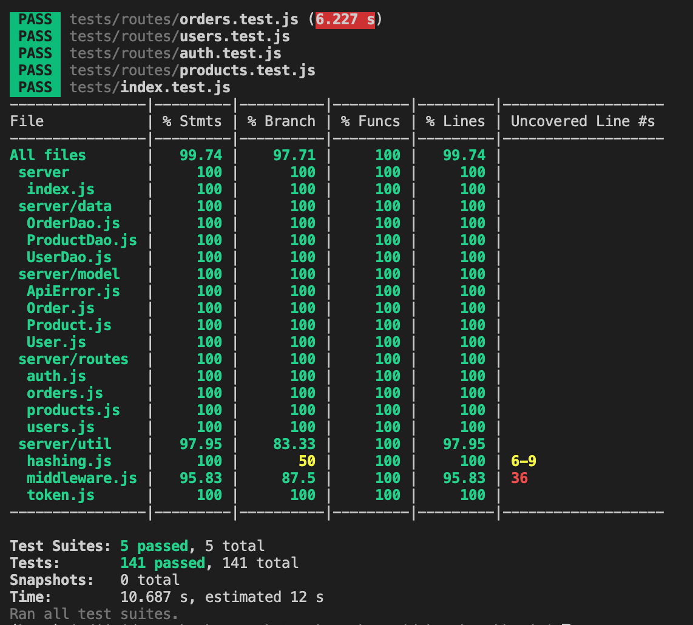

# BookStore API

This repository contains a homework submission.

```text
JHED= skancha2
GITHUB_USERNAME= sakumonk
GITHUB_REPO= https://github.com/cs280fa21-homework/homework-9-sakumonk.git
HEROKU_APP= https://bookstore-api-skancha2.herokuapp.com/
```

Please refer to the description of Homework-9, Full-Stack JavaScript (Fall 2021) for details.

## Code Coverage

